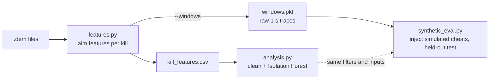
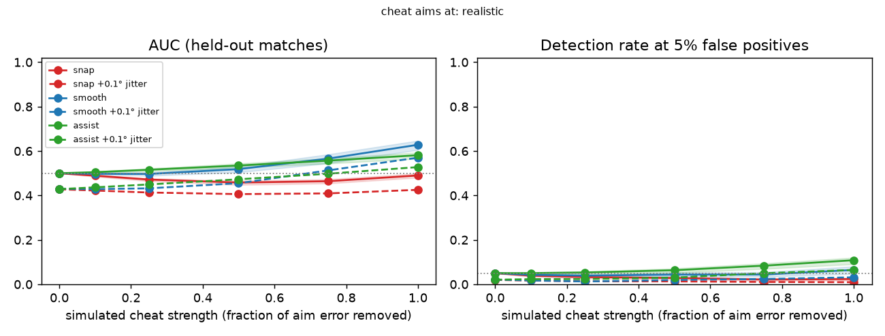
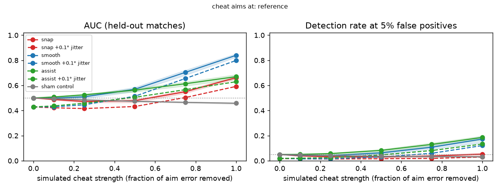
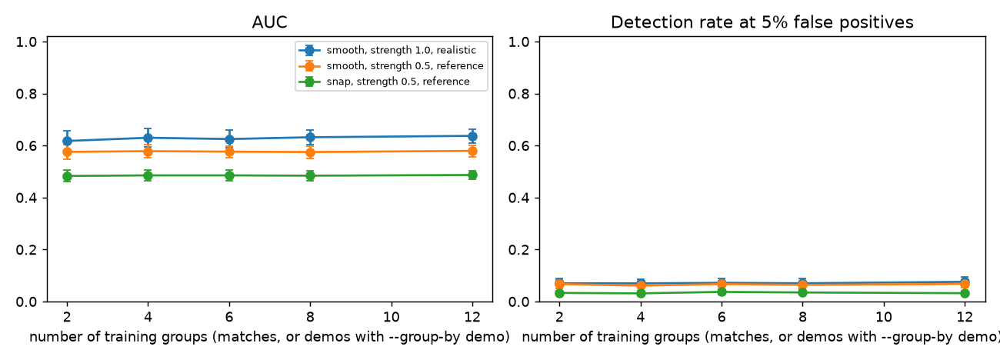

# Unsupervised learning in unusual-aim detection in CS2 
Unsupervised anomaly detection used to spot unusual aim in Valve's CS2 without labelled data. 

## How it works



1. **Extract.** For every kill, `features.py` finds the first shot of the burst that killed the victim. It measures the attacker's aim in the second before that shot: turn speed and acceleration, aim error in degrees and game units, time spent on target, and victim movement.
2. **Detect.** `analysis.py` drops kills where aim is not the story: non-guns, wallbangs, smoke, blind, point-blank and stationary victims. It then fits one Isolation Forest per weapon class.
3. **Evaluate.** There are no labels, so `synthetic_eval.py` edits real view-angle traces to simulate aim assist at strengths 0 to 1. It tests three cheats: snap, smooth and magnetism. A detector trained only on real kills then tries to flag the edited kills. Whole matches are held out, and intervals come from resampling whole matches.

## Data

There are 21 demos (not included in repo) with 2,912 kills, of which 2,388 remain after cleaning:

- 12 of my own matchmaking demos
- 9 public HLTV demos from 4 pro series

## Results

The table shows held-out results for a full-strength cheat without jitter. AUC 0.5 means edited kills look exactly as unusual as real ones. "Detected" is the share of edited kills caught at a 5% false-positive rate.

| Simulated cheat | AUC, ideal target | Detected, ideal target | AUC, realistic target | Detected, realistic target |
|---|---|---|---|---|
| smooth | 0.84 | 17% | 0.63 | 6% |
| magnetism | 0.67 | 19% | 0.58 | 11% |
| snap | 0.66 | 5% | 0.49 | 2% |
| sham (control) | 0.46 | 3% | | |

- **The ideal target is an upper bound.** That cheat aims at exactly the point the error is measured against, which leaves zero error. Only 0.1% of real kills look like that.
- **The realistic target is the victim's head as it was 3 to 6 ticks earlier.** That is closer to what a client-side cheat sees. Against it, simple aim assist is hard to tell apart from good real aim with these features.
- **More of the same data barely helps.** Detection is flat from 2 to 12 training matches.





## How the evaluation avoids fooling itself

- **Strength 0 returns the real trace bit-for-bit.** The script stops if it does not.
- **A sham edit moves the aim as much as the smooth cheat without improving it.** It stays at or below 0.5, so editing alone does not create detections.
- **Jittered cheats are also compared with equally jittered real kills.** Jitter alone scores 0.43, so comparing against untouched kills would bias the result.
- **No match appears in both training and test.** The parts and maps of one pro series count as one match.
- **The false-positive threshold can be fixed on training data.** It then flags 5.9% of held-out real kills instead of the nominal 5%.
- **A player-disjoint rerun changes no AUC by more than 0.01.**

## Limits

- **Simulated cheats are not real cheats.** The edits are simple open-loop blends toward an aim point.
- **The training data is unlabelled.** Some real kills could come from cheaters.
- **The sample is small.** It covers 16 independent matches. The pro demos have ping 0, and measured aim error rises with ping, so own-vs-pro comparisons are confounded.
- **Crouching is not modelled.** Eye height is fixed at 64 units.

## Run it

Tested with Python 3.14, demoparser2 0.42, numpy 2.5, pandas 3.0, scikit-learn 1.9 and matplotlib 3.11.

```bash
pip install demoparser2 numpy pandas scikit-learn matplotlib

# own demos (*.dem) in the repo folder, pro demos in prodemos/
python features.py --windows      # kill_features.csv + windows.pkl
python analysis.py                # plots_*.png + anomalies.csv (local review only)
python synthetic_eval.py          # synthetic_results*.csv, synthetic_detection*.png, scarcity*
python synthetic_eval.py --fast   # quicker, fewer bootstrap repeats
python testfeatures.py            # synthetic tests, no demos needed, exits 1 on failure
```
